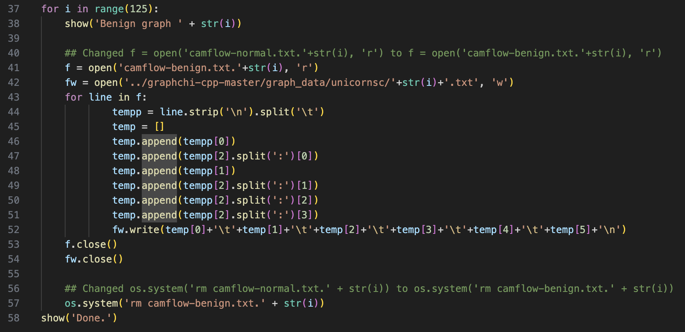
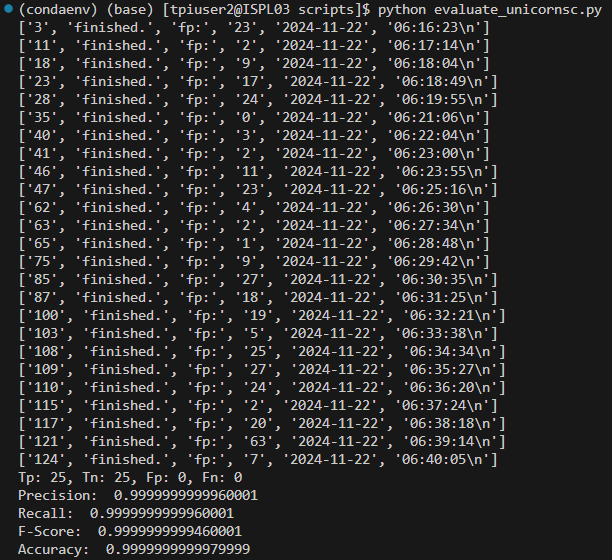
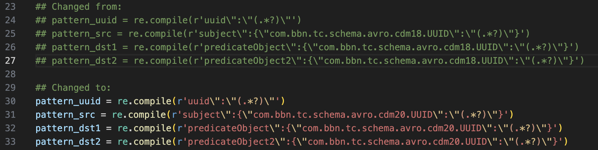

# **Updates on SC-1 and DARPA TC E5 Datasets**

We emailed the authors about (28 Oct 2024, 20:45):
1) We couldn’t find a link to the Unicorn SC-1 dataset in the project repository or paper.
2) It’s unclear which specific files of Theia, Trace, Cadets, and Fivedirections from the DARPA TC 5 dataset were used for training and evaluation.
3) Although the ground truth files for TC 3 are provided, those for TC 5 seem to be missing in the repository.

The (first) author, Su Wang replied (6 Nov 2024, 20:45):
1) Provided the link of Unicorn SC-1 dataset: 
2) Mentioned that the source code to extract the malicious nodes of DARPA TC 5 dataset is lost because of a server error.

## **Unicorn SC-1**

1) To parse the Unicorn SC-1 dataset, I had to make some name-related changes in *parse_unicorn.py* file:

    

2) I kept the remaining code files the same.

3) Obtained the following results - 100% accuracy:

    

4) The obtained results are better than the average results reported in the paper:

    | Precision | Recall | Accuracy | F-Score | TP   | TN   | FP  | FN | FPR  |
    |-----------|--------|----------|---------|------|------|-----|-----|------|
    0.93      | 0.98   | 0.95     | 0.95    | 24.5 | 23.15| 1.85| 0.5 | 0.074|

## **DARPA TC E5**

1) I tried parsing *'ta1-theia-1-e5-official-1.json'* and *'ta1-trace-1-e5-official-1.bin.1.json'* using the code provided in *parse_darpatc.py*.

    The txt files generated were empty, suggesting that there was difference in the (structure of) log files of DARPA TC E3 and DARPA TC E5.

2) I was able to parse the log files when I changed all instance of *'cdm18'* to *'cdm20'*, in *parse_darpatc.py*.

    For example:
    
    

    and so on...

    We have emailed the author to confirm if my changes are sufficient to parse the DARPA TC E5 log files.

3) There was no information about which files from THEIA, TRACE, CADETS, and FiveDirections of DARPA TC E5 dataset were used for the training and evaluation to obtain the results mentioned in the paper.

    Hence, I was not able to run the training and testing phase. We have emailed the authors asking about the details of the files used (again) and confirm if we would need to make any changes in *'train_darpatc.py'*, *'test_darpatc.py'*, *'evaluate_darpatc.py'* files.
