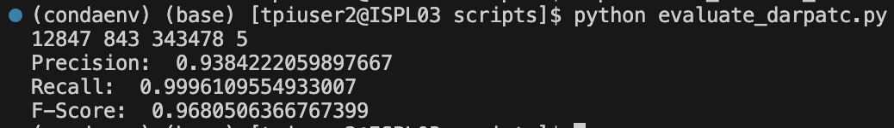

# **threaTrace**

## **Setup**

1) Fork the GitHub repo [PIDDL (forked): https://github.com/PIDDL/threaTrace,  Original: https://github.com/threaTrace-detector/threaTrace]

2) Clone the GitHub repo (https://github.com/m-shayan73/threaTrace)

3) Dependencies used: python 3.6.13, pytorch 1.9.1, torch-cluster 1.5.9, torch-geometric 1.4.3, torch-scatter 2.0.9, torch-sparse 0.6.12, torch-spline-conv 1.2.1 (same as mentioned in threaTrace's official repository)

4) To setup the environment we have used Anaconda 24.9.1. For installation follow the instructions [here](https://docs.anaconda.com/anaconda/install/):

5) Run the following commands (inside conda) to create and run the environment required for threaTrace:

    ```
    conda create -n threatrace_env python=3.6.13
    conda activate threatrace_env
    ```
    
6) Install all the dependencies:

    ```
    conda install -y pytorch==1.9.1 torchvision==0.10.1 torchaudio==0.9.1 cudatoolkit=10.2 psutil -c pytorch
    pip install -y torch-cluster==1.5.9 torch-scatter==2.0.9 torch-sparse==0.6.12 torch-spline-conv==1.2.1 -f https://data.pyg.org/whl/torch-1.9.1+cu102.html
    pip install torch-geometric==1.4.3    
    ```

7) Alternatively, we have provided a [Dockerfile](./Dockerfile) for ease.

    1) Docker build:

        ```
        docker build -t threatrace .
        ```

    2) Navigate to the downloaded / cloned threaTrace repository and run the following command to start the container with the current directory (i.e. threaTrace's repository) mounted (inside the workspace folder of the container)

        ```
        docker run -it -v "$(pwd)":/workspace threatrace
        ```

    3) To find the current / mounted directory inside the container:

        ```
        cd workspace
        ```

8) Follow the instructions mentioned in [threaTrace's readme](https://github.com/threaTrace-detector/threaTrace) to download the datasets and run the code.


9) You might encounter the following issues when attempting to run the code:

    1) torch-geometric 1.4.3 uses string_classes and int_classes modules from torch. These have been deprecated and are not available in Pytorch 1.9.1.
        
        Make the following changes in anaconda3/envs/threatrace_env/lib/python3.6/site-packages/torch_geometric/data/dataloader.py (path of dataloader.py file of torch geometric library)
    
        Original:
    
        
    
        Fix: 
    
        

        *OR*

        Run the following command (replace the path of dataloader.py file of torch geometric library accordingly):

            ```
            sed -i 's/from torch._six import container_abcs, string_classes, int_classes/import collections.abc as container_abcs\nstring_classes = str\nint_classes = int/' \
            /anaconda3/envs/threatrace_env/lib/python3.6/site-packages/torch_geometric/data/dataloader.py
            ```
    
    2) When running the train/test files, the code throws a permission error:
    
        
    
        Fix: run the following command, where ROOT is the path of threaTrace's directory:
        
            ```
            chmod 777 ROOT/graphchi-cpp-master/bin/example_apps/*
            ```

    3) threaTrace's repository does not have any instructions about running the code on Unicorn SC1 and DARPA TC5 datasets. To see our attempt to reproduce the results of these datasets, refer to [README-2](./README-2.md).

## THREATRACE Metrics Mentioned in the Paper

<div align="center">

### StreamSpot Dataset
Precision | Recall | Accuracy | F-Score | TP   | TN   | FP  | FN  | FPR  |
|-----------|--------|----------|---------|------|------|-----|-----|------|
| 0.98      | 0.99   | 0.99     | 0.99    | 24.8 | 124.5| 0.5 | 0.2 | 0.004|

### Unicorn SC Dataset
| Dataset | Precision | Recall | Accuracy | F-Score | TP   | TN   | FP  | FN  | FPR  |
|---------|-----------|--------|----------|---------|------|------|-----|-----|------|
| SC-1    | 0.93      | 0.98   | 0.95     | 0.95    | 24.5 | 23.15| 1.85| 0.5 | 0.074|
| SC-2    | 0.91      | 0.96   | 0.93     | 0.93    | 24   | 22.5 | 2.5 | 1   | 0.100|

### DARPA TC #3 and #5 Datasets
| Dataset/Scene   | Precision | Recall | F-Score | FPR   | TP     | TN      | FP    | FN    |
|-----------------|-----------|--------|---------|-------|--------|---------|-------|-------|
| #3/ THEIA       | 0.87      | 0.99   | 0.93    | 0.001 | 25,297 | 3,501,561 | 3,765 | 65    |
| #3/ Trace       | 0.72      | 0.99   | 0.83    | 0.011 | 67,382 | 2,389,233 | 26,774| 14,642|
| #3/ CADETS      | 0.90      | 0.99   | 0.95    | 0.002 | 12,848 | 705,605   | 1,361 | 4     |
| #3/ fivedirections | 0.67   | 0.92   | 0.78    | 0.001 | 389    | 569,660   | 188   | 36    |
| #5/ THEIA       | 0.70      | 0.92   | 0.80    | 0.008 | 150,286| 8,321,358 | 63,137| 12,428|
| #5/ Trace       | 0.81      | 0.85   | 0.83    | 0.003 | 25,021 | 1,819,337 | 60,471| 4,828 |
| #5/ CADETS      | 0.63      | 0.86   | 0.73    | 0.021 | 17,685 | 472,045   | 10,521| 2,839 |
| #5/ fivedirections | 0.64   | 0.75   | 0.69    | 0.001 | 908    | 920,740   | 501   | 296   |

</div>


## **Running and Evaluating threaTrace:**

1) Streamspot:

    1) Pre-trained models:

        

    2) My trained models:

        

        

2) Unicorn SC2:

    1) Pre-trained models:

        The *"threshold_unicorn.txt"* file is not provided with the pre-trained models; this file is otherwise created when we run *"train.py"*. Since threshold is not provided, I used arbitary values of 0 and 1. The results will detoriate further when using values > 1.

        1) Using threshold = 0

            

        2) Using threshold = 1

            

    2) My trained models:

        

        

***Darpa TC #3:*** When using the pre-trained models, copy the groundtruth file of the respective dataset file to *"scripts"* folder and rename it to *"groundtruth_uuid.txt"* **(not mentioned in the official repository)** along with the provided example models.

3) Cadets:

    1) Pre-trained models:

        Before using the pre-trained model, copy the respective mode

        

    2) My trained models:

        

4) Five-Directions:

    1) Pre-trained models:

        

    2) My trained models:

        

5) Theia:

    1) Pre-trained models:

        

    2) My trained models:

        

6) Trace:

    1) Pre-trained models:

        

    2) My trained models:

        


## **Use of Testing Data in Training Phase** 

1) Streamspot:

    In splitDataset() function of train_streamspot.py:
    1) Validation Set A has 20 random graphs from graph # 300-399 and Testing Set of attack graphs have 10 random graphs from graph # 300-399. 
    2) Validation Set B has 10 random graphs from each set of 100 graphs (0-99,100-199,...)
    3) Testing Set of benign graphs has the (remaining) 25 graphs from each set of 100 graphs. 
    Here, the validation and testing set can include the same graphs.

    

2) Unicorn:

    In splitDataset() function of train_unicorn.py:
    1) Validate A has 10 attack graphs, all of which are in the test set
    2) Validate B has 50 benign graphs, which could be in the test set.

    


3) DARPA TC:

    In validate() function of train_darpatc.py, the test data is being accessed and any model that performs poorly is deleted with the condition `if (_tp/len(nodeA) > 0.8) and (_tp/(_tp+_fp+eps) > 0.7)`.

    ```
        def validate():
        global fp, tn
        global loader, device, model, optimizer, data

        show('Start validating')

        ## Loads the test data
        path = '../graphchi-cpp-master/graph_data/darpatc/' + args.scene + '_test.txt'
        data, feature_num, label_num, adj, adj2, nodeA, _nodeA, _neibor = MyDatasetA(path, 0)
        dataset = TestDatasetA(data)
        data = dataset[0]
        print(data)
        loader = NeighborSampler(data, size=[1.0, 1.0], num_hops=2, batch_size=b_size, shuffle=False, add_self_loops=True)
        
        device = torch.device('cpu')	
        Net = SAGENet	
        model1 = Net(feature_num, label_num).to(device)
        model = model1
        optimizer = torch.optim.Adam(model.parameters(), lr=0.01, weight_decay=5e-4)
        fp = []
        tn = []

        out_loop = -1
        while(1):
            out_loop += 1
            print('validating in model ', str(out_loop))
            model_path = '../models/model_'+str(out_loop)
            if not osp.exists(model_path): break
            model.load_state_dict(torch.load(model_path))
            fp = []
            tn = []

            ## In MyDatasetA, train and test masks are set to True for all nodes. So, evaluating on test data in training phase?
            auc = final_test(data.test_mask)
            
            print('fp and fn: ', len(fp), len(tn))
            _fp = 0
            _tp = 0
            eps = 1e-10
            tempNodeA = {}
            for i in nodeA:
                tempNodeA[i] = 1
            for i in fp:
                if not i in _nodeA:
                    _fp += 1
                if not i in _neibor.keys():
                    continue
                for j in _neibor[i]:
                    if j in tempNodeA.keys():
                        tempNodeA[j] = 0
            for i in tempNodeA.keys():
                if tempNodeA[i] == 0:
                    _tp += 1
            print('Precision: ', _tp/(_tp+_fp))
            print('Recall: ', _tp/len(nodeA))
            
            ## Returns 1 - Keeps the model - If precision > 0.7 and recall > 0.8
            if (_tp/len(nodeA) > 0.8) and (_tp/(_tp+_fp+eps) > 0.7):
                while (1):
                    out_loop += 1
                    model_path = '../models/model_'+str(out_loop)
                    if not osp.exists(model_path): break
                    os.system('rm ../models/model_'+str(out_loop))
                    os.system('rm ../models/tn_feature_label_'+str(graphId)+'_'+str(out_loop)+'.txt')
                    os.system('rm ../models/fp_feature_label_'+str(graphId)+'_'+str(out_loop)+'.txt')
                return 1
            
            ## Returns 0 - Removes the model - If recall < 0.8
            if (_tp/len(nodeA) <= 0.8):
                return 0
            
            for j in tn:
                data.test_mask[j] = False
            
        return 0
    ```


## **Key Issues:**

1) No requirement.txt
2) Deprecated modules of pytorch (1.9.1) in torch-geometric 1.4.3
3) Default permissions of train and test files in ROOT/graphchi-cpp-master/bin/example_apps/ directory are not sufficient to run the code. 
4) Paper mentions use of Unicorn SC1 and DARPA TC5 datasets in evaluation process, however official repository has no code regarding them. (Emailed, [GitHub Issue #20](https://github.com/threaTrace-detector/threaTrace/issues/20), [GitHub Issue #21](https://github.com/threaTrace-detector/threaTrace/issues/21))
5) No use of seed - which could be reason my results do not exactly match those provided in the paper ([GitHub Issue #19](https://github.com/threaTrace-detector/threaTrace/issues/19) + Emailed)
6) Missing threshold_unicorn.txt file when using pre-trained models. ([GitHub Issue #17](https://github.com/threaTrace-detector/threaTrace/issues/17) + Emailed)
7) Provided pre-trained models of streamspot and trace do not seem to be working properly. ([GitHub Issue #17](https://github.com/threaTrace-detector/threaTrace/issues/17) + Emailed)
8) Use of Testing Data in Training Phase ([GitHub Issue #18](https://github.com/threaTrace-detector/threaTrace/issues/18) + Emailed)