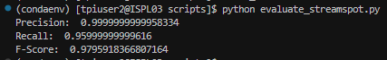
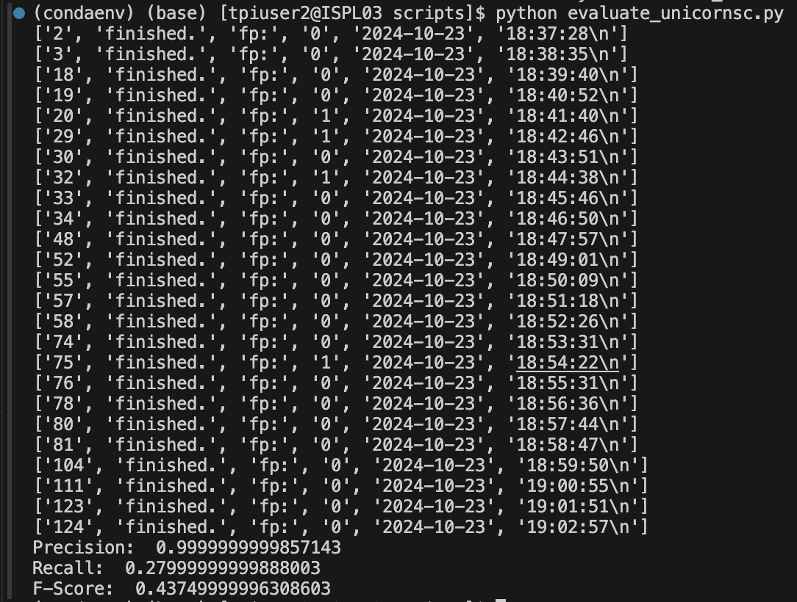
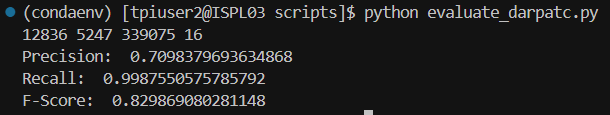
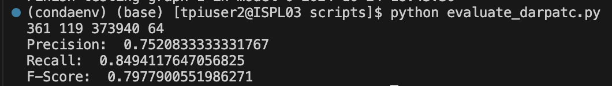
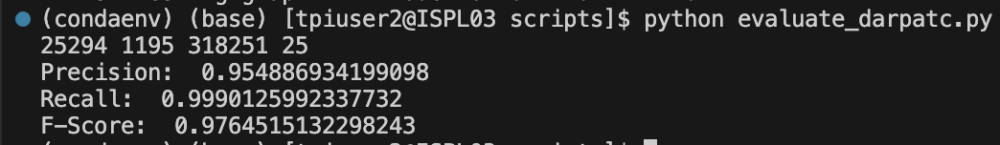
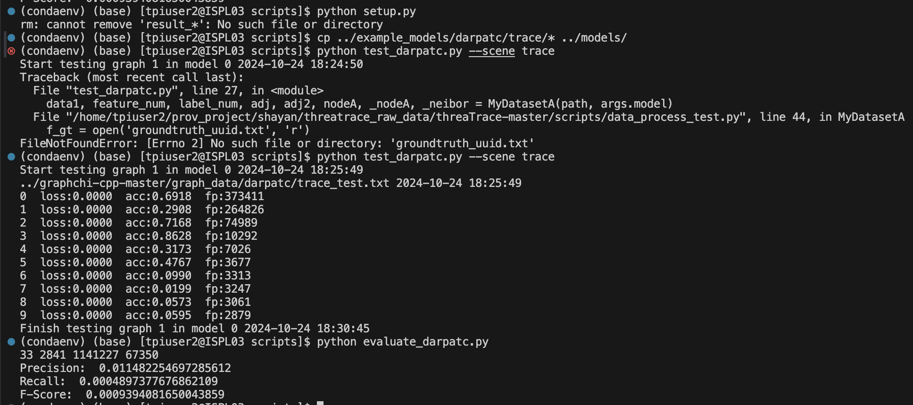

# **threaTrace**

## **Setup**

1) Fork the GitHub repo [PIDDL (forked): https://github.com/PIDDL/threaTrace,  Original: https://github.com/threaTrace-detector/threaTrace]

2) Clone the GitHub repo (https://github.com/m-shayan73/threaTrace)

3) Dependencies used: python 3.6.13, pytorch 1.9.1, torch-cluster 1.5.9, torch-geometric 1.4.3, torch-scatter 2.0.9, torch-sparse 0.6.12, torch-spline-conv 1.2.1 (same as mentioned in threaTrace's official repository)

4) torch-geometric 1.4.3 uses string_classes and int_classes modules from torch. These have been deprecated and are not available in Pytorch 1.9.1.

    

    Fix: 

    

5) When running the train/test files, the code throws a permission error:

    

    Fix: chmod 777 ROOT/graphchi-cpp-master/bin/example_apps/*

## THREATRACE Metrics Mentioned in the Paper

### StreamSpot Dataset
Precision | Recall | Accuracy | F-Score | TP   | TN   | FP  | FN  | FPR  |
|-----------|--------|----------|---------|------|------|-----|-----|------|
| 0.98      | 0.99   | 0.99     | 0.99    | 24.8 | 124.5| 0.5 | 0.2 | 0.004|

### Unicorn SC Dataset
| Dataset | Precision | Recall | Accuracy | F-Score | TP   | TN   | FP  | FN  | FPR  |
|---------|-----------|--------|----------|---------|------|------|-----|-----|------|
| SC-1    | 0.93      | 0.98   | 0.95     | 0.95    | 24.5 | 23.15| 1.85| 0.5 | 0.074|
| SC-2    | 0.91      | 0.96   | 0.93     | 0.93    | 24   | 22.5 | 2.5 | 1   | 0.100|

### DARPA TC #3 and #5 Datasets
| Dataset/Scene   | Precision | Recall | F-Score | FPR   | TP     | TN      | FP    | FN    |
|-----------------|-----------|--------|---------|-------|--------|---------|-------|-------|
| #3/ THEIA       | 0.87      | 0.99   | 0.93    | 0.001 | 25,297 | 3,501,561 | 3,765 | 65    |
| #3/ Trace       | 0.72      | 0.99   | 0.83    | 0.011 | 67,382 | 2,389,233 | 26,774| 14,642|
| #3/ CADETS      | 0.90      | 0.99   | 0.95    | 0.002 | 12,848 | 705,605   | 1,361 | 4     |
| #3/ fivedirections | 0.67   | 0.92   | 0.78    | 0.001 | 389    | 569,660   | 188   | 36    |
| #5/ THEIA       | 0.70      | 0.92   | 0.80    | 0.008 | 150,286| 8,321,358 | 63,137| 12,428|
| #5/ Trace       | 0.81      | 0.85   | 0.83    | 0.003 | 25,021 | 1,819,337 | 60,471| 4,828 |
| #5/ CADETS      | 0.63      | 0.86   | 0.73    | 0.021 | 17,685 | 472,045   | 10,521| 2,839 |
| #5/ fivedirections | 0.64   | 0.75   | 0.69    | 0.001 | 908    | 920,740   | 501   | 296   |

## **Running and Evaluating threaTrace:**

1) Streamspot:

    1) Pre-trained models:

        

    2) My trained models:

        

        

2) Unicorn SC:

    1) Pre-trained models:

        The *"threshold_unicorn.txt"* file is not provided with the pre-trained models; this file is otherwise created when we run *"train.py"*. Since threshold is not provided, I used arbitary values of 0 and 1. The results will detoriate further when using values > 1.

        1) Using threshold = 0

            

        2) Using threshold = 1

            

    2) My trained models:

        

        

***Darpa TC #3:*** When using the pre-trained models, copy the groundtruth file of the respective dataset file to *"scripts"* folder and rename it to *"groundtruth_uuid.txt"* **(not mentioned in the official repository)** along with the provided example models.

3) Cadets:

    1) Pre-trained models:

        Before using the pre-trained model, copy the respective mode

        

    2) My trained models:

        

4) Five-Directions:

    1) Pre-trained models:

        

    2) My trained models:

        

5) Theia:

    1) Pre-trained models:

        

    2) My trained models:

        

6) Trace:

    1) Pre-trained models:

        

    2) My trained models:

        

## **Key Issues:**

1) No requirement.txt
2) Deprecated modules of pytorch (1.9.1) in torch-geometric 1.4.3
3) Default permissions of train and test files in ROOT/graphchi-cpp-master/bin/example_apps/ directory are not sufficient to run the code. 
4) Paper mentions use of Unicorn SC1 and DARPA TC5 datasets in evaluation process, however official repository has no code regarding them.
5) No use of seed 
6) Results do not match those provided in the paper
7) Missing threshold_unicorn.txt file when using pre-trained models.
7) Provided pre-trained models of streamspot and trace do not seem to be working properly.