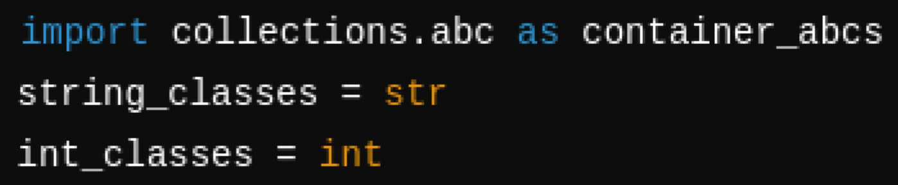
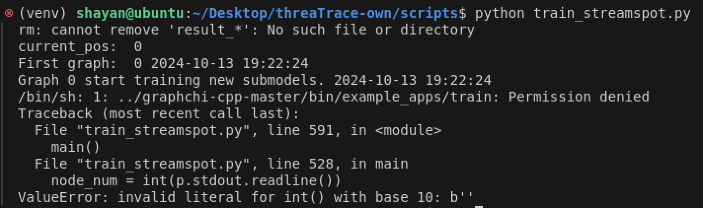
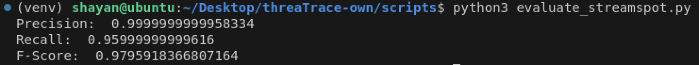
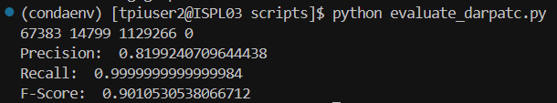

# **threaTrace**

## **Setup**

1) Fork the GitHub repo [PIDDL (forked): https://github.com/PIDDL/threaTrace,  Original: https://github.com/threaTrace-detector/threaTrace]

2) Clone the GitHub repo (https://github.com/m-shayan73/threaTrace)

3) Dependencies used: python 3.6.13, pytorch 1.9.1, torch-cluster 1.5.9, torch-geometric 1.4.3, torch-scatter 2.0.9, torch-sparse 0.6.12, torch-spline-conv 1.2.1 (same as mentioned in threaTrace's official repository)

4) torch-geometric 1.4.3 uses string_classes and int_classes modules from torch. These have been deprecated and are not available in Pytorch 1.9.1.

    

    Fix: 

    

5) When running the train/test files, the code throws a permission error:

    

    Fix: chmod 777 ROOT/graphchi-cpp-master/bin/example_apps/*

## **Running and Evaluating threaTrace:**

1) Streamspot:

    1) Pre-trained models:

        

    2) My trained models:

        

        

2) Unicorn SC:

    1) Pre-trained models:

        

    2) My trained models:

        

        

3) Cadets:

    1) Pre-trained models:

        

    2) My trained models:

        

4) Five-Directions:

    1) Pre-trained models:

        

    2) My trained models:

        

5) Theia:

    1) Pre-trained models:

        

    2) My trained models:

        

6) Trace:

    1) Pre-trained models:

        

    2) My trained models:

        